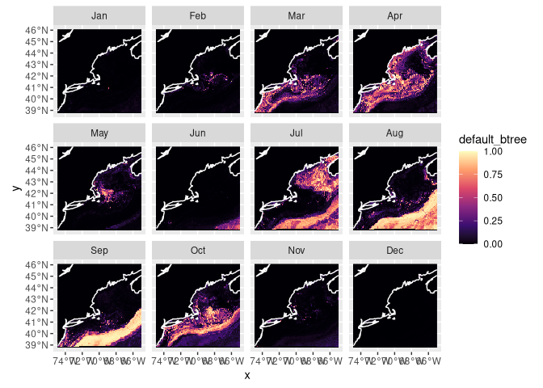
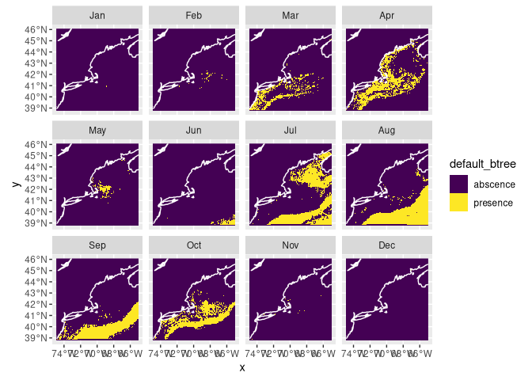
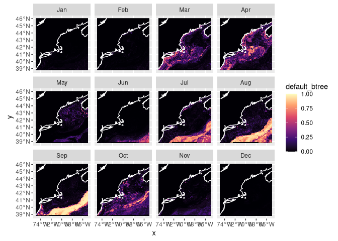
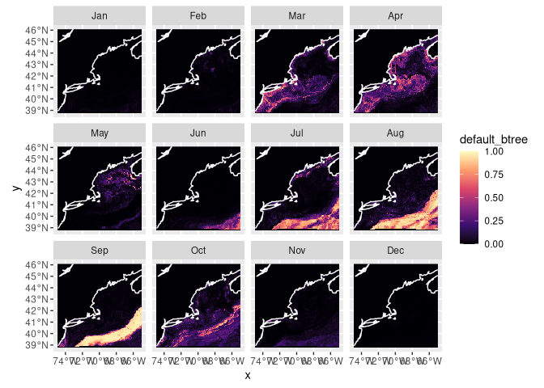

Ammodytes dubius Assignment 5
================

# Setup

``` r
knitr::opts_chunk$set(echo = TRUE)
source("setup.R")
```

# Load the Brickman data

``` r
cfg = read_configuration(scientificname = "Ammodytes dubius",
                         version = "v1", 
                         path = data_path("models"))
db = brickman_database()
db = brickman_database()
present_conditions = read_brickman(db |> filter(scenario == "PRESENT", 
                                                interval == "mon"),
                       add = c("depth", "month")) |>
  select(all_of(cfg$keep_vars))
```

# Load the workflow

We read the model information we created.

``` r
model_fits = read_model_fit(filename = "Ammodytes_dubius-v1-model_fits")
model_fits
```

    ## # A tibble: 4 × 7
    ##   wflow_id   splits              id    .metrics .notes   .predictions .workflow 
    ##   <chr>      <list>              <chr> <list>   <list>   <list>       <list>    
    ## 1 default_g… <split [7960/1137]> trai… <tibble> <tibble> <tibble>     <workflow>
    ## 2 default_rf <split [7960/1137]> trai… <tibble> <tibble> <tibble>     <workflow>
    ## 3 default_b… <split [7960/1137]> trai… <tibble> <tibble> <tibble>     <workflow>
    ## 4 default_m… <split [7960/1137]> trai… <tibble> <tibble> <tibble>     <workflow>

# Make a prediction

First we make a “nowcast” which is just a prediction of the current
environmental conditions.

## Nowcast

First make the prediction using \`predict_stars()’ to show the current
probability of Northern Sand Lance in different areas of the Gulf of
Maine.

``` r
nowcast = predict_stars(model_fits, present_conditions)
nowcast
```

    ## stars object with 3 dimensions and 4 attributes
    ## attribute(s):
    ##                         Min.      1st Qu.       Median        Mean      3rd Qu.
    ## default_glm     2.220446e-16 2.220446e-16 2.220446e-16 0.003678954 1.269760e-11
    ## default_rf      1.446169e-02 1.568929e-01 2.443904e-01 0.261004012 3.495616e-01
    ## default_btree   3.259317e-05 1.116175e-03 1.116175e-03 0.072806992 1.546797e-02
    ## default_maxent  1.369788e-03 4.075092e-02 7.844355e-02 0.112745109 1.478623e-01
    ##                      Max.  NA's
    ## default_glm     0.7411261 59796
    ## default_rf      0.7320158 59796
    ## default_btree   0.9876510     0
    ## default_maxent  0.7342674 59796
    ## dimension(s):
    ##       from  to offset    delta refsys point      values x/y
    ## x        1 121 -74.93  0.08226 WGS 84 FALSE        NULL [x]
    ## y        1  89  46.08 -0.08226 WGS 84 FALSE        NULL [y]
    ## month    1  12     NA       NA     NA    NA Jan,...,Dec

Now we can plot what is called a “habitat suitability index” (hsi) map.

``` r
plot_prediction(nowcast['default_btree'])
```

    ## numeric

<!-- -->

We can also plot a presence/absence labeled map.

``` r
pa_nowcast = threshold_prediction(nowcast, threshold = 0.4)
plot_prediction(pa_nowcast['default_btree'])
```

<!-- -->

## Forecast

Now we forecast for RCP85 and 45 in 2075 and 2055. We plot this data/
predictions on a map of the Gulf of Maine

``` r
covars_rcp85_2075 = read_brickman(db |> filter(scenario == "RCP85", 
                                               year == 2075, 
                                               interval == "mon"),
                                  add = c("depth", "month")) |>
  select(all_of(cfg$keep_vars))
covars_rcp85_2055 = read_brickman(db |> filter(scenario == "RCP85", 
                                               year == 2055, 
                                               interval == "mon"),
                                  add = c("depth", "month")) |>
  select(all_of(cfg$keep_vars))
```

``` r
forecast_2075_RCP85 = predict_stars(model_fits, covars_rcp85_2075)
forecast_2075_RCP85
```

    ## stars object with 3 dimensions and 4 attributes
    ## attribute(s):
    ##                         Min.      1st Qu.       Median        Mean      3rd Qu.
    ## default_glm     2.220446e-16 2.220446e-16 2.220446e-16 0.004195439 1.563753e-11
    ## default_rf      3.574789e-02 1.814806e-01 2.550964e-01 0.266001780 3.364829e-01
    ## default_btree   3.318013e-05 1.116175e-03 1.116175e-03 0.058114794 1.916541e-02
    ## default_maxent  1.058564e-03 3.414753e-02 6.803664e-02 0.104968466 1.339232e-01
    ##                      Max.  NA's
    ## default_glm     0.7995087 59796
    ## default_rf      0.6596124 59796
    ## default_btree   0.9848128     0
    ## default_maxent  0.8360230 59796
    ## dimension(s):
    ##       from  to offset    delta refsys point      values x/y
    ## x        1 121 -74.93  0.08226 WGS 84 FALSE        NULL [x]
    ## y        1  89  46.08 -0.08226 WGS 84 FALSE        NULL [y]
    ## month    1  12     NA       NA     NA    NA Jan,...,Dec

``` r
forecast_2055_RCP85 = predict_stars(model_fits, covars_rcp85_2055)
forecast_2055_RCP85
```

    ## stars object with 3 dimensions and 4 attributes
    ## attribute(s):
    ##                         Min.      1st Qu.       Median        Mean      3rd Qu.
    ## default_glm     2.220446e-16 2.220446e-16 2.220446e-16 0.004163185 1.604707e-11
    ## default_rf      3.539650e-02 1.788092e-01 2.501562e-01 0.262022634 3.316873e-01
    ## default_btree   2.804441e-05 1.116175e-03 1.116175e-03 0.054780357 1.736428e-02
    ## default_maxent  1.363706e-03 3.534282e-02 6.845061e-02 0.103704383 1.333223e-01
    ##                      Max.  NA's
    ## default_glm     0.7868207 59796
    ## default_rf      0.6554797 59796
    ## default_btree   0.9877099     0
    ## default_maxent  0.7873022 59796
    ## dimension(s):
    ##       from  to offset    delta refsys point      values x/y
    ## x        1 121 -74.93  0.08226 WGS 84 FALSE        NULL [x]
    ## y        1  89  46.08 -0.08226 WGS 84 FALSE        NULL [y]
    ## month    1  12     NA       NA     NA    NA Jan,...,Dec

``` r
plot_prediction(forecast_2075_RCP85['default_btree'])
```

    ## numeric

<!-- -->

``` r
plot_prediction(forecast_2055_RCP85['default_btree'])
```

    ## numeric

<!-- -->
Now for RCP45!

``` r
covars_rcp46_2075 = read_brickman(db |> filter(scenario == "RCP85", 
                                               year == 2075, 
                                               interval == "mon"),
                                  add = c("depth", "month")) |>
  select(all_of(cfg$keep_vars))
covars_rcp45_2055 = read_brickman(db |> filter(scenario == "RCP85", 
                                               year == 2055, 
                                               interval == "mon"),
                                  add = c("depth", "month")) |>
  select(all_of(cfg$keep_vars))
```

``` r
forecast_2075_RCP45 = predict_stars(model_fits, covars_rcp85_2075)
forecast_2075_RCP45
```

    ## stars object with 3 dimensions and 4 attributes
    ## attribute(s):
    ##                         Min.      1st Qu.       Median        Mean      3rd Qu.
    ## default_glm     2.220446e-16 2.220446e-16 2.220446e-16 0.004195439 1.563753e-11
    ## default_rf      3.574789e-02 1.814806e-01 2.550964e-01 0.266001780 3.364829e-01
    ## default_btree   3.318013e-05 1.116175e-03 1.116175e-03 0.058114794 1.916541e-02
    ## default_maxent  1.058564e-03 3.414753e-02 6.803664e-02 0.104968466 1.339232e-01
    ##                      Max.  NA's
    ## default_glm     0.7995087 59796
    ## default_rf      0.6596124 59796
    ## default_btree   0.9848128     0
    ## default_maxent  0.8360230 59796
    ## dimension(s):
    ##       from  to offset    delta refsys point      values x/y
    ## x        1 121 -74.93  0.08226 WGS 84 FALSE        NULL [x]
    ## y        1  89  46.08 -0.08226 WGS 84 FALSE        NULL [y]
    ## month    1  12     NA       NA     NA    NA Jan,...,Dec

``` r
forecast_2055_RCP45 = predict_stars(model_fits, covars_rcp85_2055)
forecast_2055_RCP45
```

    ## stars object with 3 dimensions and 4 attributes
    ## attribute(s):
    ##                         Min.      1st Qu.       Median        Mean      3rd Qu.
    ## default_glm     2.220446e-16 2.220446e-16 2.220446e-16 0.004163185 1.604707e-11
    ## default_rf      3.539650e-02 1.788092e-01 2.501562e-01 0.262022634 3.316873e-01
    ## default_btree   2.804441e-05 1.116175e-03 1.116175e-03 0.054780357 1.736428e-02
    ## default_maxent  1.363706e-03 3.534282e-02 6.845061e-02 0.103704383 1.333223e-01
    ##                      Max.  NA's
    ## default_glm     0.7868207 59796
    ## default_rf      0.6554797 59796
    ## default_btree   0.9877099     0
    ## default_maxent  0.7873022 59796
    ## dimension(s):
    ##       from  to offset    delta refsys point      values x/y
    ## x        1 121 -74.93  0.08226 WGS 84 FALSE        NULL [x]
    ## y        1  89  46.08 -0.08226 WGS 84 FALSE        NULL [y]
    ## month    1  12     NA       NA     NA    NA Jan,...,Dec

``` r
plot_prediction(forecast_2075_RCP45['default_btree'])
```

    ## numeric

<!-- -->

``` r
plot_prediction(forecast_2055_RCP45['default_btree'])
```

    ## numeric

<!-- -->
\## Save the predictions

Now we save our predictions.

``` r
# make sure the output directory exists
path = make_path("predictions")

write_prediction(nowcast,
                 scientificname = cfg$scientificname,
                 version = cfg$version,
                 year = "CURRENT",
                 scenario = "CURRENT")
write_prediction(forecast_2075_RCP85,
                 scientificname = cfg$scientificname,
                 version = cfg$version,
                 year = "2075",
                 scenario = "RCP85")
write_prediction(forecast_2055_RCP85,
                 scientificname = cfg$scientificname,
                 version = cfg$version,
                 year = "2055",
                 scenario = "RCP85")
write_prediction(forecast_2075_RCP45,
                 scientificname = cfg$scientificname,
                 version = cfg$version,
                 year = "2075",
                 scenario = "RCP45")
write_prediction(forecast_2055_RCP45,
                 scientificname = cfg$scientificname,
                 version = cfg$version,
                 year = "2055",
                 scenario = "RCP45")
```
