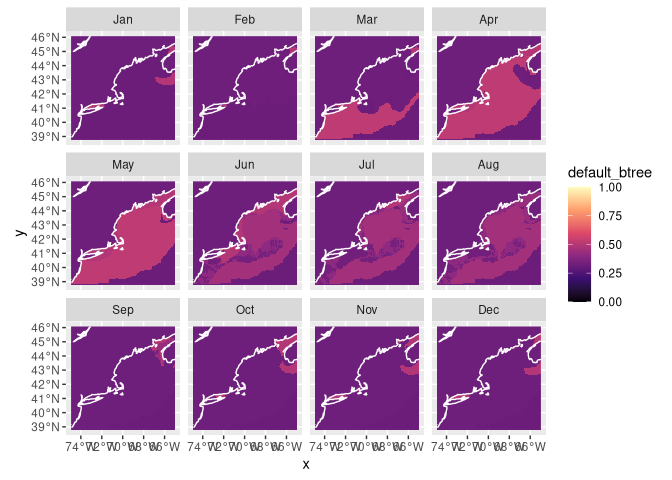
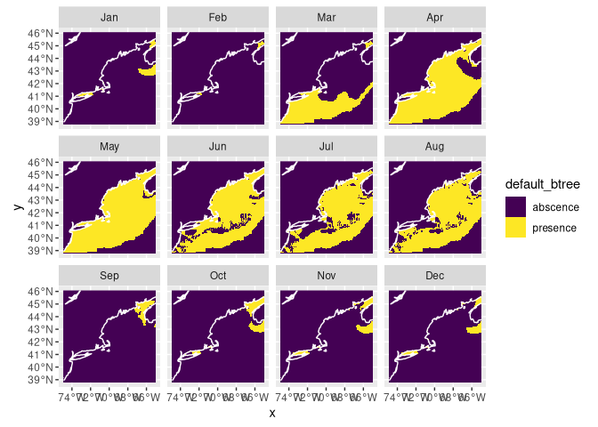
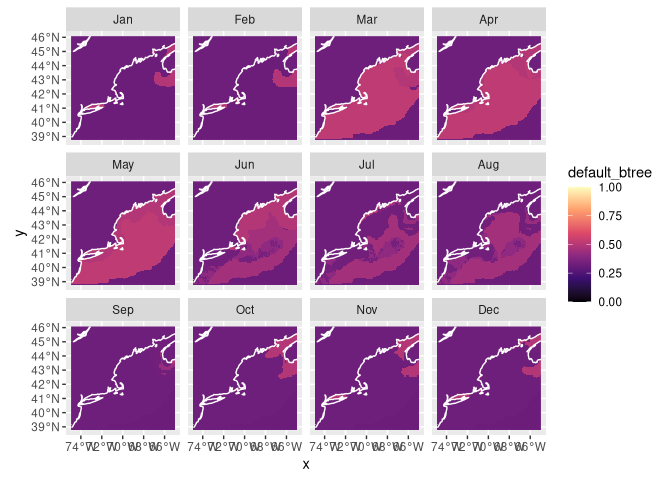
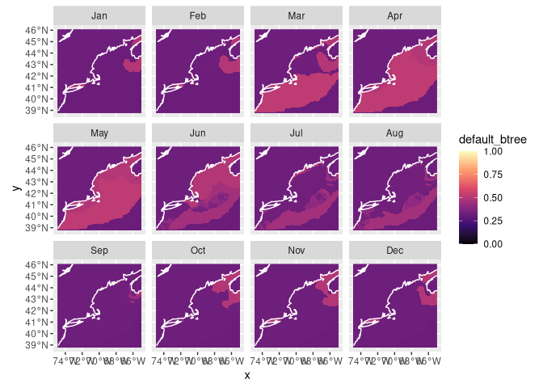

Assirngment 5
================

# Setup

``` r
knitr::opts_chunk$set(echo = TRUE)
source("/home/lrkerm28/ColbyForecasting/setup.R")
```

# Load the Brickman data

``` r
cfg = read_configuration(scientificname = "Halichoerus grypus",
                         version = "v1", 
                         path = data_path("models"))
db = brickman_database()
db = brickman_database()
present_conditions = read_brickman(db |> filter(scenario == "PRESENT", 
                                                interval == "mon"),
                       add = c("depth", "month")) |>
  select(all_of(cfg$keep_vars))
```

# Load the workflow

We read the model information we created.

``` r
model_fits = read_model_fit(filename = "Halichoerus_grypus-v1-model_fits")
model_fits
```

    ## # A tibble: 4 × 7
    ##   wflow_id     splits            id    .metrics .notes   .predictions .workflow 
    ##   <chr>        <list>            <chr> <list>   <list>   <list>       <list>    
    ## 1 default_glm  <split [502/255]> trai… <tibble> <tibble> <tibble>     <workflow>
    ## 2 default_rf   <split [502/255]> trai… <tibble> <tibble> <tibble>     <workflow>
    ## 3 default_btr… <split [502/255]> trai… <tibble> <tibble> <tibble>     <workflow>
    ## 4 default_max… <split [502/255]> trai… <tibble> <tibble> <tibble>     <workflow>

# Make a prediction

First we make a “nowcast” which is just a prediction of the current
environmental conditions.

## Nowcast

First make the prediction using \`predict_stars()’ to show the current
probability of Grey Seals in different areas of the Gulf of Maine.

``` r
nowcast = predict_stars(model_fits, present_conditions)
nowcast
```

    ## stars object with 3 dimensions and 4 attributes
    ## attribute(s):
    ##                         Min.      1st Qu.       Median         Mean
    ## default_glm     2.220446e-16 2.220446e-16 2.220446e-16 6.944014e-07
    ## default_rf      1.195011e-01 2.757380e-01 3.601397e-01 3.798132e-01
    ## default_btree   3.163683e-01 3.230500e-01 3.230500e-01 3.528220e-01
    ## default_maxent  3.818467e-03 2.001609e-01 3.855312e-01 4.090392e-01
    ##                      3rd Qu.         Max.  NA's
    ## default_glm     2.220446e-16 0.0004897095 59796
    ## default_rf      4.676700e-01 0.8518875003 59796
    ## default_btree   3.262048e-01 0.5180429816     0
    ## default_maxent  6.062816e-01 0.9330225151 59796
    ## dimension(s):
    ##       from  to offset    delta refsys point      values x/y
    ## x        1 121 -74.93  0.08226 WGS 84 FALSE        NULL [x]
    ## y        1  89  46.08 -0.08226 WGS 84 FALSE        NULL [y]
    ## month    1  12     NA       NA     NA    NA Jan,...,Dec

Now we can plot what is called a “habitat suitability index” (hsi) map.

``` r
plot_prediction(nowcast['default_btree'])
```

    ## numeric

<!-- -->

We can also plot a presence/absence labeled map.

``` r
pa_nowcast = threshold_prediction(nowcast, threshold = 0.4)
plot_prediction(pa_nowcast['default_btree'])
```

<!-- -->

## Forecast

Now we forecast for RCP85 and 45 in 2075 and 2055. We plot this data/
predictions on a map of the Gulf of Maine

``` r
covars_rcp85_2075 = read_brickman(db |> filter(scenario == "RCP85", 
                                               year == 2075, 
                                               interval == "mon"),
                                  add = c("depth", "month")) |>
  select(all_of(cfg$keep_vars))
covars_rcp85_2055 = read_brickman(db |> filter(scenario == "RCP85", 
                                               year == 2055, 
                                               interval == "mon"),
                                  add = c("depth", "month")) |>
  select(all_of(cfg$keep_vars))
```

``` r
forecast_2075_RCP85 = predict_stars(model_fits, covars_rcp85_2075)
forecast_2075_RCP85
```

    ## stars object with 3 dimensions and 4 attributes
    ## attribute(s):
    ##                         Min.      1st Qu.       Median         Mean
    ## default_glm     2.220446e-16 2.220446e-16 2.220446e-16 7.375726e-07
    ## default_rf      1.257239e-01 2.851915e-01 3.682778e-01 3.818161e-01
    ## default_btree   3.163683e-01 3.230500e-01 3.230500e-01 3.569362e-01
    ## default_maxent  3.316446e-03 1.714367e-01 3.449257e-01 3.821485e-01
    ##                      3rd Qu.         Max.  NA's
    ## default_glm     2.220446e-16 0.0004875617 59796
    ## default_rf      4.604981e-01 0.8046281811 59796
    ## default_btree   3.303476e-01 0.5180429816     0
    ## default_maxent  5.804103e-01 0.9351773167 59796
    ## dimension(s):
    ##       from  to offset    delta refsys point      values x/y
    ## x        1 121 -74.93  0.08226 WGS 84 FALSE        NULL [x]
    ## y        1  89  46.08 -0.08226 WGS 84 FALSE        NULL [y]
    ## month    1  12     NA       NA     NA    NA Jan,...,Dec

``` r
forecast_2055_RCP85 = predict_stars(model_fits, covars_rcp85_2055)
forecast_2055_RCP85
```

    ## stars object with 3 dimensions and 4 attributes
    ## attribute(s):
    ##                         Min.      1st Qu.       Median         Mean
    ## default_glm     2.220446e-16 2.220446e-16 2.220446e-16 7.036269e-07
    ## default_rf      1.336810e-01 2.927170e-01 3.701485e-01 3.870214e-01
    ## default_btree   3.163683e-01 3.230500e-01 3.230500e-01 3.545407e-01
    ## default_maxent  2.705593e-03 1.817184e-01 3.543418e-01 3.896963e-01
    ##                      3rd Qu.         Max.  NA's
    ## default_glm     2.220446e-16 0.0004715223 59796
    ## default_rf      4.656410e-01 0.8149138548 59796
    ## default_btree   3.303476e-01 0.5180429816     0
    ## default_maxent  5.845540e-01 0.9354972132 59796
    ## dimension(s):
    ##       from  to offset    delta refsys point      values x/y
    ## x        1 121 -74.93  0.08226 WGS 84 FALSE        NULL [x]
    ## y        1  89  46.08 -0.08226 WGS 84 FALSE        NULL [y]
    ## month    1  12     NA       NA     NA    NA Jan,...,Dec

``` r
plot_prediction(forecast_2075_RCP85['default_btree'])
```

    ## numeric

<!-- -->

``` r
plot_prediction(forecast_2055_RCP85['default_btree'])
```

    ## numeric

<!-- --> Now for
RCP45!

``` r
covars_rcp46_2075 = read_brickman(db |> filter(scenario == "RCP85", 
                                               year == 2075, 
                                               interval == "mon"),
                                  add = c("depth", "month")) |>
  select(all_of(cfg$keep_vars))
covars_rcp45_2055 = read_brickman(db |> filter(scenario == "RCP85", 
                                               year == 2055, 
                                               interval == "mon"),
                                  add = c("depth", "month")) |>
  select(all_of(cfg$keep_vars))
```

``` r
forecast_2075_RCP45 = predict_stars(model_fits, covars_rcp85_2075)
forecast_2075_RCP45
```

    ## stars object with 3 dimensions and 4 attributes
    ## attribute(s):
    ##                         Min.      1st Qu.       Median         Mean
    ## default_glm     2.220446e-16 2.220446e-16 2.220446e-16 7.375726e-07
    ## default_rf      1.257239e-01 2.851915e-01 3.682778e-01 3.818161e-01
    ## default_btree   3.163683e-01 3.230500e-01 3.230500e-01 3.569362e-01
    ## default_maxent  3.316446e-03 1.714367e-01 3.449257e-01 3.821485e-01
    ##                      3rd Qu.         Max.  NA's
    ## default_glm     2.220446e-16 0.0004875617 59796
    ## default_rf      4.604981e-01 0.8046281811 59796
    ## default_btree   3.303476e-01 0.5180429816     0
    ## default_maxent  5.804103e-01 0.9351773167 59796
    ## dimension(s):
    ##       from  to offset    delta refsys point      values x/y
    ## x        1 121 -74.93  0.08226 WGS 84 FALSE        NULL [x]
    ## y        1  89  46.08 -0.08226 WGS 84 FALSE        NULL [y]
    ## month    1  12     NA       NA     NA    NA Jan,...,Dec

``` r
forecast_2055_RCP45 = predict_stars(model_fits, covars_rcp85_2055)
forecast_2055_RCP45
```

    ## stars object with 3 dimensions and 4 attributes
    ## attribute(s):
    ##                         Min.      1st Qu.       Median         Mean
    ## default_glm     2.220446e-16 2.220446e-16 2.220446e-16 7.036269e-07
    ## default_rf      1.336810e-01 2.927170e-01 3.701485e-01 3.870214e-01
    ## default_btree   3.163683e-01 3.230500e-01 3.230500e-01 3.545407e-01
    ## default_maxent  2.705593e-03 1.817184e-01 3.543418e-01 3.896963e-01
    ##                      3rd Qu.         Max.  NA's
    ## default_glm     2.220446e-16 0.0004715223 59796
    ## default_rf      4.656410e-01 0.8149138548 59796
    ## default_btree   3.303476e-01 0.5180429816     0
    ## default_maxent  5.845540e-01 0.9354972132 59796
    ## dimension(s):
    ##       from  to offset    delta refsys point      values x/y
    ## x        1 121 -74.93  0.08226 WGS 84 FALSE        NULL [x]
    ## y        1  89  46.08 -0.08226 WGS 84 FALSE        NULL [y]
    ## month    1  12     NA       NA     NA    NA Jan,...,Dec

``` r
plot_prediction(forecast_2075_RCP45['default_btree'])
```

    ## numeric

<!-- -->

``` r
plot_prediction(forecast_2055_RCP45['default_btree'])
```

    ## numeric

<!-- --> \## Save
the predictions

Now we save our predictions.

``` r
# make sure the output directory exists
path = make_path("predictions")

write_prediction(nowcast,
                 scientificname = cfg$scientificname,
                 version = cfg$version,
                 year = "CURRENT",
                 scenario = "CURRENT")
write_prediction(forecast_2075_RCP85,
                 scientificname = cfg$scientificname,
                 version = cfg$version,
                 year = "2075",
                 scenario = "RCP85")
write_prediction(forecast_2055_RCP85,
                 scientificname = cfg$scientificname,
                 version = cfg$version,
                 year = "2055",
                 scenario = "RCP85")
write_prediction(forecast_2075_RCP45,
                 scientificname = cfg$scientificname,
                 version = cfg$version,
                 year = "2075",
                 scenario = "RCP45")
write_prediction(forecast_2055_RCP45,
                 scientificname = cfg$scientificname,
                 version = cfg$version,
                 year = "2055",
                 scenario = "RCP45")
```
