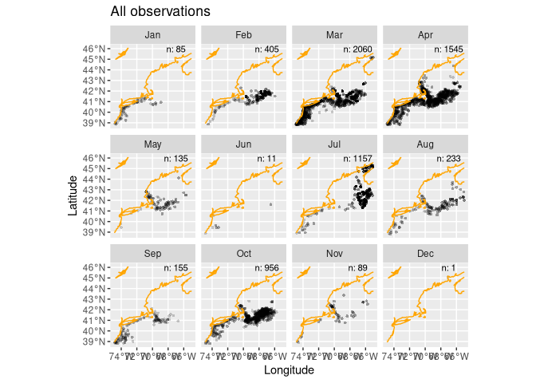
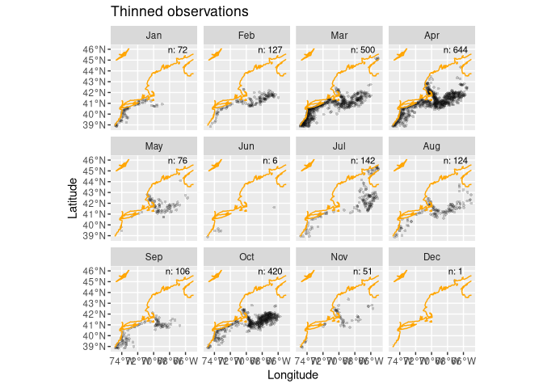
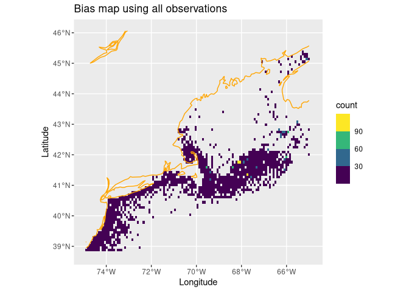
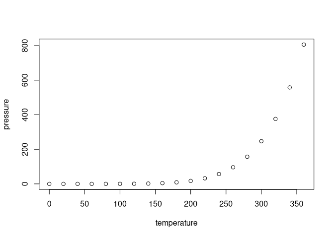

Assignment 3
================

``` r
knitr::opts_chunk$set(echo = TRUE)
source("/home/lrkerm28/ColbyForecasting/setup.R")
#source("setup.R")
```

``` r
coast = read_coastline()
obs = read_observations(scientificname = "Ammodytes dubius")
db = brickman_database() |>
  filter(scenario == "STATIC", var == "mask")
mask = read_brickman(db)
```

## Read secondary species

Download the data from obis on Ammodytes dubius, then it can be made
into a variable.

``` r
sand_lance = fetch_obis(scientificname = "Ammodytes dubius")
```

    ## Retrieved 5000 records of approximately 6982 (71%)Retrieved 6982 records of
    ## approximately 6982 (100%)

## Filter New Data

We use “read_observations()” to filter the NAs and not needed
information out of the data. We then give it a summary to check that all
of the NAs have been filtered out.

``` r
sand_lance = read_observations(scientificname = "Ammodytes dubius")
summary(sand_lance)
```

    ##       id            basisOfRecord        eventDate               year     
    ##  Length:6832        Length:6832        Min.   :1970-03-16   Min.   :1970  
    ##  Class :character   Class :character   1st Qu.:1981-04-08   1st Qu.:1981  
    ##  Mode  :character   Mode  :character   Median :1990-10-09   Median :1990  
    ##                                        Mean   :1995-05-02   Mean   :1995  
    ##                                        3rd Qu.:2008-07-10   3rd Qu.:2008  
    ##                                        Max.   :2021-08-04   Max.   :2021  
    ##                                                                           
    ##      month       eventTime         individualCount              geom     
    ##  Mar    :2060   Length:6832        Min.   :    1.0   POINT        :6832  
    ##  Apr    :1545   Class :character   1st Qu.:    1.0   epsg:4326    :   0  
    ##  Jul    :1157   Mode  :character   Median :    5.0   +proj=long...:   0  
    ##  Oct    : 956                      Mean   :  178.8                       
    ##  Feb    : 405                      3rd Qu.:   29.0                       
    ##  Aug    : 233                      Max.   :30052.0                       
    ##  (Other): 476                      NA's   :3841

## Making Background and Presence Data

With code provided from the C02_background doc, we can see/make the
background and save it in a readable file for the next tasks.

``` r
LON0 = -67
LAT0 = 46
all_counts = count(st_drop_geometry(obs), month) # counting is faster without spatial baggage
all_counts
```

    ## # A tibble: 12 × 2
    ##    month     n
    ##    <fct> <int>
    ##  1 Jan      85
    ##  2 Feb     405
    ##  3 Mar    2060
    ##  4 Apr    1545
    ##  5 May     135
    ##  6 Jun      11
    ##  7 Jul    1157
    ##  8 Aug     233
    ##  9 Sep     155
    ## 10 Oct     956
    ## 11 Nov      89
    ## 12 Dec       1

``` r
ggplot() +
  geom_sf(data = obs, alpha = 0.2, shape = "circle small", size = 1) +
  geom_sf(data = coast, col = "orange") +
  geom_text(data = all_counts,
            mapping = aes(x = LON0, 
                          y = LAT0, 
                          label = sprintf("n: %i", .data$n)),
                          size = 3) + 
  labs(x = "Longitude", y = "Latitude", title = "All observations") +
  facet_wrap(~month)
```

<!-- --> \##
Thin Data

``` r
thinned_obs = sapply(month.abb,
               function(mon){ 
                 thin_by_cell(obs |> filter(month == mon), mask)
               }, simplify = FALSE) |>
  dplyr::bind_rows() 

# another count
thinned_counts = count(st_drop_geometry(thinned_obs), month)

ggplot() +
  geom_sf(data = thinned_obs, 
          alpha = 0.2, 
          shape = "circle small", 
          size = 1) +
  geom_sf(data = coast, col = "orange") +
  geom_text(data = thinned_counts,
            mapping = aes(x = LON0, 
                          y = LAT0, 
                          label = sprintf("n: %i", .data$n)),
                          size = 3) + 
  labs(x = "Longitude", y = "Latitude", title = "Thinned observations") +
  facet_wrap(~month)
```

<!-- --> \##
Weighted sampling

``` r
bias_map = rasterize_point_density(obs, mask) # <-- note the original observations

ggplot() +
  geom_stars(data = bias_map, aes(fill = count)) +
  scale_fill_viridis_b(na.value = "transparent") +
  geom_sf(data = coast, col = "orange") + 
  labs(x = "Longitude", y = "Latitude", title = "Bias map using all observations")
```

<!-- --> \## Randomly
sample background points

``` r
nback_avg = mean(all_counts$n) |>
  round()
nback_avg
```

    ## [1] 569

``` r
obsbkg = sapply(month.abb,
    function(mon){ 
      sample_background(thinned_obs |> filter(month == mon), # <- just this month
                       bias_map,
                       method = "bias",  # <-- it needs to know it's a bias map
                       return_pres = TRUE, # <-- give me the obs back, too
                       n = nback_avg) |>   # <-- how many points
        mutate(month = mon, .before = 1)
    }, simplify = FALSE) |>
  bind_rows() |>
  mutate(month = factor(month, levels = month.abb))
obsbkg 
```

    ## Simple feature collection with 9097 features and 2 fields
    ## Geometry type: POINT
    ## Dimension:     XY
    ## Bounding box:  xmin: -74.89169 ymin: 38.84822 xmax: -65 ymax: 45.37854
    ## Geodetic CRS:  WGS 84
    ## # A tibble: 9,097 × 3
    ##    month class                geometry
    ##  * <fct> <fct>             <POINT [°]>
    ##  1 Jan   presence       (-73.43 39.85)
    ##  2 Jan   presence     (-73.6 39.88333)
    ##  3 Jan   presence    (-73.98333 39.95)
    ##  4 Jan   presence     (-71.9 41.03333)
    ##  5 Jan   presence     (-73.03333 40.6)
    ##  6 Jan   presence         (-74.7 38.9)
    ##  7 Jan   presence     (-71.4 41.01667)
    ##  8 Jan   presence        (-69.6 40.88)
    ##  9 Jan   presence (-72.01667 40.93333)
    ## 10 Jan   presence (-74.68333 39.11667)
    ## # ℹ 9,087 more rows

## Last step to save it

``` r
write_model_input(obsbkg, scientificname = "Ammodytes dubius")
```

``` r
x = read_model_input(scientificname = "Ammodytes dubius")
```

You can also embed plots, for example:

<!-- -->

Note that the `echo = FALSE` parameter was added to the code chunk to
prevent printing of the R code that generated the plot.
